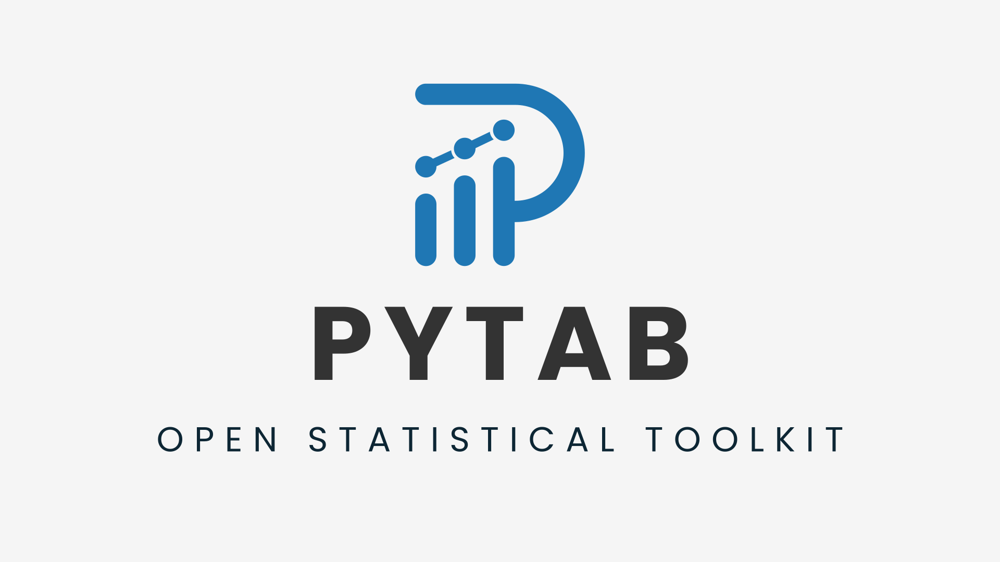

<p align="center">
<p align="center">
  
</p>

<p align="center">
  <a href="LICENSE">
    
  </a>
  
  
  
  
  
</p>

# PyTab  
Toolkit estatístico aberto, simples e poderoso — inspirado no Minitab.

---

## 1. Visão Geral

**PyTab** é uma ferramenta estatística moderna, intuitiva e open-source, construída para fornecer análises confiáveis sem exigir conhecimento em programação.

Inspirado no Minitab, porém:

- aberto  
- acessível  
- simples de usar  
- altamente visual  
- centrado em análise prática  

Ele atende profissionais de **dados, qualidade, melhoria contínua, engenharia, gestão e Lean Six Sigma**.

---

## 2. Funcionalidades Principais

### Entrada de Dados
- Leitura robusta de **CSV problemáticos**
- Detecção inteligente de encoding e separadores
- Suporte a Excel (.xlsx)
- Identificação automática de tipos
- Pré-visualização amigável

### Estatísticas
- Média, Mediana, Mín/Max
- Desvio padrão, variância
- Coeficiente de variação (CV)
- Contagem de faltantes
- Cartões/resumos estilo dashboard

### Fase **Medir**
- Agregação temporal (dia/semana/mês/trim/ano)
- Série temporal com média móvel
- Boxplot
- Detecção de outliers (Z-score, IQR, MAD, Automático)
- Narrativa automática
- Visual limpo e técnico

### Fase **Analisar**
- Matriz de correlação
- Pareto profissional
- Regressão linear simples
- Narrativas interpretativas
- Recomendações automáticas

### Tema Visual PyTab
- Azul técnico: `#1f77b4`
- Laranja científico: `#ec7f00`
- Fontes escuras, legibilidade máxima
- Gráficos consistentes
- Sem poluição visual

---

## 3. Arquitetura

````
pytab/
├── charts/
├── io/
├── stats/
├── utils/
└── reports/

pytab_app/
├── fases/
│ ├── medir/
│ ├── analisar/
│ ├── melhorar/
│ └── controlar/
├── modules/
└── streamlit_app.py

docs/
├── architecture.md
├── dmaic_overview.md
└── assets/
````


Documentação complementar:

- [`GLOSSARIO.md`](GLOSSARIO.md)  
- [`USAGE.md`](USAGE.md)  
- [`ROADMAP.md`](ROADMAP.md)  
- [`docs/architecture.md`](docs/architecture.md)  
- [`docs/dmaic_overview.md`](docs/dmaic_overview.md)

---

## 4. Instalação

### Desenvolvimento local
```bash
git clone https://github.com/DeboraKlein/Pytab
cd PyTab

pip install -e .

Executar app Streamlit
bash

Copiar código
streamlit run pytab_app/streamlit_app.py
```

## 5. Roadmap Resumido

Confira em detalhes em ROADMAP.md.

### Próximos passos:

testes estatísticos (t-test, ANOVA, Qui-Quadrado)

regressões múltiplas e logísticas

gráficos de controle (Xbar, R, p, np, u, c)

relatórios PDF automáticos

módulo Melhorar (simulação)

módulo Controlar (monitoramento)

publicação PyPI (pip install pytab)

## 6. Contribuição

Contribuições são bem-vindas.

  Leia o architecture.md

  Consulte o ROADMAP.md

  Envie PRs corretos e documentados

## 7. Licença

MIT License — livre para uso pessoal e comercial.


