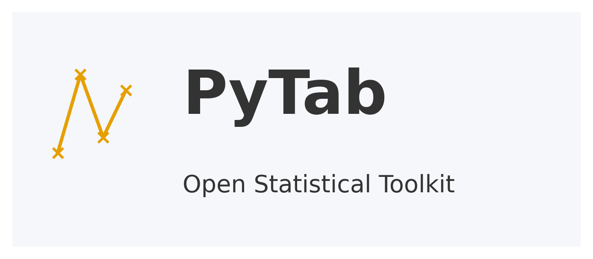

<p align="center">
  
</p>

# PyTab  
Análises estatísticas rápidas, acessíveis e open-source.


# PyTab  
Análises estatísticas rápidas, acessíveis e open-source.

[](LICENSE)
[]()
[]()
[]()

PyTab é uma ferramenta estatística desenvolvida em Python para análise rápida de dados, identificação de outliers, gráficos de controle (SPC) e geração de relatórios automáticos.  
Inspirado na simplicidade de softwares como o Minitab, o PyTab oferece uma alternativa moderna, open-source e acessível para análises estatísticas essenciais.

---

## 1. Objetivo do PyTab

Ferramentas estatísticas tradicionais são poderosas, porém:

- possuem alto custo de licença  
- não integram facilmente com pipelines modernos  
- são fechadas e pouco transparentes  
- não são acessíveis a estudantes, equipes públicas ou pequenos negócios  

O PyTab nasce para ser:

- open-source  
- automatizável  
- transparente  
- fácil de usar  
- aplicável em qualquer área (saúde, finanças, qualidade, compras públicas, operações, etc.)

---

## 2. Para quem é o PyTab?

### Usuários finais

- profissionais Lean Six Sigma  
- analistas de qualidade  
- engenheiros de processos  
- gestores e consultores  
- estudantes  

O PyTab oferece:

- upload de dados  
- estatísticas automáticas  
- gráficos clássicos (histograma, boxplot, Pareto)  
- SPC (XmR)  
- relatórios em PDF  

Tudo via Streamlit, **sem necessidade de programar**.

---

### Desenvolvedores e equipes técnicas

A biblioteca interna é modular e reutilizável:

- `pytab.io` – leitura robusta de CSV/Excel  
- `pytab.stats` – cálculos estatísticos  
- `pytab.charts` – construção de gráficos  
- `pytab.reports` – relatórios automáticos  
- `pytab_app` – interface em Streamlit  

Ideal para automações, pipelines de dados e notebooks.

---

## 3. Lean Six Sigma e o papel do PyTab

Lean Six Sigma é uma metodologia baseada em dados e estatística para:

- reduzir variabilidade  
- eliminar desperdícios  
- analisar estabilidade de processos  
- controlar desempenho  

O PyTab facilita especialmente as etapas DMAIC:

### Measure  
- estatísticas descritivas  
- entendimento inicial do processo  

### Analyze  
- outliers  
- variabilidade  
- Pareto  
- distribuição  
- gráficos de controle  

### Control  
- SPC  
- relatórios automáticos  

---

## 4. Funcionalidades (atual e planejadas)

### Versão 0.1.0

- leitura inteligente de CSV/Excel  
- detecção automática de tipos de dados  
- estatísticas descritivas  
- prévia dos dados no app  

### Próximas versões

- histograma e boxplot  
- cálculo de z-score e outliers  
- Pareto  
- SPC (XmR)  
- relatórios PDF (executivo + técnico)  
- análise temporal automática  

Roadmap completo:  
 **[ROADMAP.md](ROADMAP.md)**

---

## 5. Arquitetura do PyTab

O projeto segue um modelo modular, separando claramente responsabilidades:

````
PyTab/
├── pytab/
│   ├── __init__.py
│   ├── io/
│   │   ├── __init__.py
│   │   └── reader.py
│   ├── stats/
│   │   ├── __init__.py
│   │   └── descriptive.py
│   ├── charts/
│   │   ├── __init__.py
│   │   └── control_chart.py
│   ├── reports/
│   │   ├── __init__.py
│   │   └── pdf_report.py
│   └── utils/
│       ├── __init__.py
│       └── schema.py
│
├── pytab_app/
│   ├── __init__.py
│   └── streamlit_app.py
│
├── docs/
│   ├── architecture.md
│   ├── dmaic_overview.md
│   ├── modules.md
│   └── usage.md
│
├── tests/
│   └── test_reader.py
│
├── .github/
│   ├── ISSUE_TEMPLATE/
│   │   ├── bug_report.md
│   │   └── feature_request.md
│   └── PULL_REQUEST_TEMPLATE.md
│
├── README.md
├── ROADMAP.md
├── LICENSE
├── pyproject.toml
└── .gitignore

````


Documentação técnica detalhada está em `docs/`.

---

## 6. Instalação e uso

Clonar o repositório:

git clone https://github.com/DeboraKlein/Pytab

cd PyTab


Instalação em modo desenvolvimento:

pip install -e .


Executar o aplicativo:

streamlit run pytab_app/streamlit_app.py


---

## 7. Contribuição

Contribuições são bem-vindas.

- Leia `docs/architecture.md` para entender a estrutura interna  
- Consulte `ROADMAP.md` para ver o planejamento  
- Use os templates de issues para reportar problemas ou sugerir funcionalidades

---

## 8. Licença

PyTab é distribuído sob licença MIT.  
Você é livre para usar, modificar e distribuir esta ferramenta, desde que mantenha o aviso de copyright.


